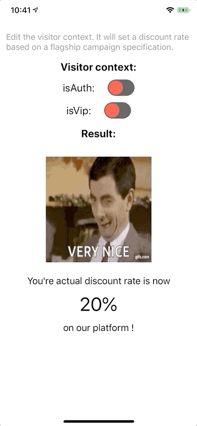

# Sample of Expo CLI using [Flagship - React Native SDK](../../README.md)

<p align="center">

</p>

## Getting Started

```
npm install
```

## Start the project

-   iOS or android:

```
npm run start
```

-   scan the QR code with your phone
