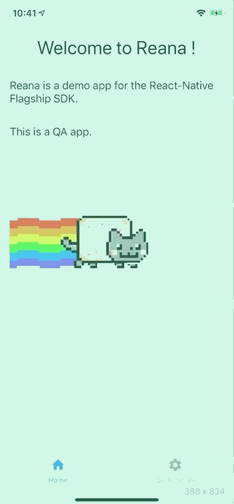

# Sample of React Native CLI using [Flagship - React Native SDK](../../README.md)

<p align="center">

</p>

## Getting Started

• `npm install -g react-native-cli`

• `npm install`

## Run in local in 2 steps

### STEP 1 - Put the project on your phone locally

- iOS:

```
npm run ios
```

- android:

```
npm run android
```

### STEP 2 - Run react-native on your computer

```
npm start
```

or with no cache

```
npm run start:withClearCache
```

## Create an .apk file

### with Android Studio:

1. Open Android Studio

2. Open "Build" in the Menu

3. "Build bundle(s) / APK(s)" > "Build APK"

4. Generated .apk file is located in `android/app/build/outputs/apk/debug/app-debug.apk`

NOTE: You can switch between "debug" / "release" variant if you click on "Build Variants" vertical tabs

### with CLI:

1.  [Resource and asset merger: Duplicate resources app:mergeReleaseResources](https://github.com/facebook/react-native/issues/22234#issuecomment-437812451)

2.  Edit the `/node_modules/react-native/react.gradle` file and add exactly this:

    ```
    // after "doFirst"
    doLast {
                    def moveFunc = { resSuffix ->
                        File originalDir = file("$buildDir/generated/res/react/release/drawable-${resSuffix}");
                        if (originalDir.exists()) {
                            File destDir = file("$buildDir/../src/main/res/drawable-${resSuffix}");
                            ant.move(file: originalDir, tofile: destDir);
                        }
                    }
                    moveFunc.curry("ldpi").call()
                    moveFunc.curry("mdpi").call()
                    moveFunc.curry("hdpi").call()
                    moveFunc.curry("xhdpi").call()
                    moveFunc.curry("xxhdpi").call()
                    moveFunc.curry("xxxhdpi").call()
                    moveFunc.curry("raw").call()
                    // moveFunc.curry("values").call()
                    // moveFunc.curry("mipmap").call()
                }
    ```

3.  Run:

    ```
    npm run create:android:debug

    ```

which executes:

    ```
    react-native run-android --variant=debug

    ```

4.  The .apk is located in **examples/react-native-cli-demo/android/app/build/outputs/apk/debug**

## Libraries used

- [react navigation](https://reactnavigation.org/docs/en/getting-started.html)
- [react native elements](https://react-native-elements.github.io/react-native-elements/docs/overview.html)
- [react-native-style-tachyons](https://github.com/tachyons-css/react-native-style-tachyons)
- [react-native-json-tree](https://www.npmjs.com/package/react-native-json-tree)
- [grid](https://github.com/GeekyAnts/react-native-easy-grid)
- [font-awesome-icons](https://fontawesome.com/icons?d=gallery&q=cross&m=free)
- [redux-persist](https://github.com/rt2zz/redux-persist)
